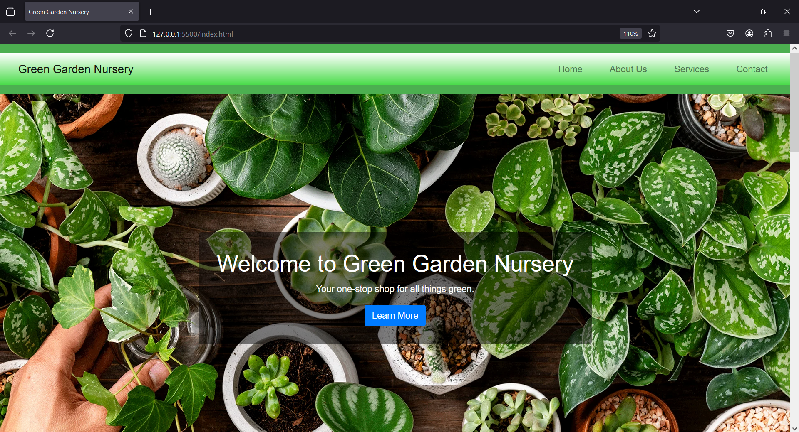

# OCTANET_Web_Development

This is a repository of tasks assigned to me during my internship in web development at Octanet Services Pvt Ltd.

# Task 1: Landing Page - Green Garden Nursery

This project is a landing page designed as part of the OCTANET Web Development tasks. The landing page is built using HTML, CSS, and Bootstrap.



## Features

- **Responsive Design**: The landing page is fully responsive and works well on different screen sizes.
- **Modern UI/UX**: Designed with a modern user interface and user experience in mind.
- **Interactive Elements**: Includes interactive elements such as buttons, hover effects, and form inputs.
- **Parallax Effect**: The page features a parallax scrolling effect to create a visually appealing experience.

## Technologies Used

- **HTML**: Structure of the webpage.
- **CSS**: Styling and layout of the webpage.
- **Bootstrap**: Responsive design and components.

## Installation

To run this project locally, follow these steps:

1. Clone the repository:
   ```bash
   git clone https://github.com/minal-12/OCTANET_Web_Developement.git
2. Link:
   https://greengardennursery.netlify.app/


# Task 1: To-Do List

 The To-Do List is built using HTML, CSS, and Javascript.


## Features

- **Responsive Design**: The landing page is fully responsive and works well on different screen sizes.
- **Interactive Elements**: Includes interactive elements such as buttons, hover effects, and form inputs.


## Technologies Used

- **HTML**: Structure of the webpage.
- **CSS**: Styling and layout of the webpage.
-**JavaScript**: Functionality and interactivity of the webpage.


## Installation

To run this project locally, follow these steps:

1. Clone the repository:
   ```bash
   git clone https://github.com/minal-12/OCTANET_Web_Developement.git

